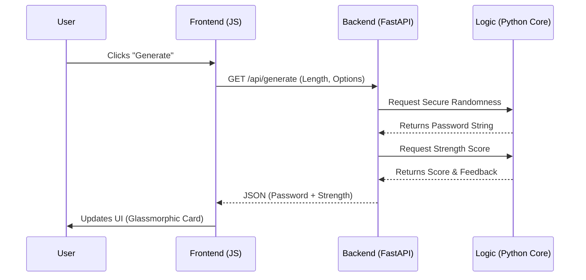

# ShieldGen | Secure Password Utility


ShieldGen is a high-performance, full-stack web application designed for generating cryptographically secure passwords and analyzing password strength. Built with a focus on security best practices and modern aesthetics.

## 🚀 Key Features

- **Cryptographic Randomness:** Uses Python's `secrets` module for industry-standard security.
- **Real-time Strength Analysis:** Instant feedback on password entropy and complexity.
- **Glassmorphic UI:** A state-of-the-art dark theme dashboard with modern micro-interactions.
- **Zero-Trust Architecture:** Passwords are never logged or stored on the server.
- **Responsive Design:** Works seamlessly across desktop and mobile devices.

## 🛠️ Tech Stack

- **Backend:** [FastAPI](https://fastapi.tiangolo.com/) (Python)
- **Frontend:** HTML5, Vanilla CSS3 (Custom Design), JavaScript (ES6+)
- **Cryptography:** Python `secrets` library
- **Documentation:** Automatic Swagger UI generation

## 📂 Project Structure

```text
Password-co/
├── backend/                # FastAPI Application
│   ├── core/               # Business logic (Generation & Strength algorithms)
│   ├── main.py             # API routes and CORS configuration
│   └── requirements.txt    # Python dependencies
├── frontend/               # Web Interface
│   ├── index.html          # UI structure
│   ├── style.css           # Custom Glassmorphic design
│   └── script.js           # Frontend logic & API communication
└── .gitignore              # Version control exclusions
```

## 🔄 System Flow



## ⚙️ Getting Started

### 1. Prerequisites

- Python 3.10+
- Git

### 2. Setup Backend

```bash
cd backend
python -m venv .venv
source .venv/bin/activate  # On Windows: .\.venv\Scripts\activate
pip install -r requirements.txt
python main.py
```

### 3. Setup Frontend

Simply open `frontend/index.html` in your browser, or use the VS Code **Live Server** extension for the best experience.

## 🔒 Security

ShieldGen follows the principle of "Zero Knowledge." All generation logic occurs on the server using cryptographically secure random number generators (CSPRNG), and the data is wiped from memory as soon as the response is sent. No databases or logs are used to store user input.

## 📄 License

This project is open-source and available under the [MIT License](LICENSE).